# 第１章　ドメイン駆動設計の紹介

## この章で述べられること

開発者の仕事→  
X  コードを書くこと  
○ ソフトウェアで問題解決すること（設計、コミュニケーション、コードを書くこと）

ゴミをいれば、ゴミがでてくる

以下によってゴミの入力を減らす→DDD（Domain-Driven Design:ドメイン駆動設計）

- コミュニケーション
- ドメイン知識の共有

※DDDはすべてに適用できるものではない、他に適したものもある。

ドメインエキスパートと共有するメンタルモデルの作り方
- データ構造ではなく、ビジネスイベントやワークフローに焦点を当てる
- ドメインをより小さなサブドメインに分割する
- 各サブドメインのモデルを解決空間に作成する
- プロジェクトに関わるすべての人が共有し、コードのあらゆるばしょで使用される共通言語（ユビキタス言語）を開発する

## モデルの共有
問題を正しく理解して解決するには？→ドメインエキスパートの知識・問題理解を解決手段に反映する

本番にリリースされる解決手段→開発者の理解→正しく問題を解決するには？→開発者とドメインエキスパートの理解が近い必要がある！

ソフトウェア開発プロセス（仕様書、要件定義書）→ドメインエキスパートのメンタルモデルの翻訳→メンタルモデルの共有
要件からコードへの翻訳なく、メンタルモデルをコードに落とし込めるようにしよう→ドメイン駆動設計の目標

※個人的感想
１だと、コードの意図は？？→設計書を見る→設計書にない→要件定義書を見る→要件定義書にない→要件定義書を作った人に聞くとなる  
コード作成時は、実装上の問題や改良により、設計書にない変更や要件定義書にない変更が加えられる可能性がある→実装者が上流資料にフィードバックすることはほぼない（主観）  

共有されたメンタルモデル（なんらかの成果物）に直接ドメインエキスパートの知識が反映される  
→コードに落とし込むまでの速度、確認の手間が省ける  
メンタルモデル成果物に開発者（実装者も関与できる）→ 最近会社が良く言ってる開発者が顧客思考を実践するって、メンタルモデルの構築に実装者が関わることでは？  

ソフトウェアモデルとビジネスドメインの一致によるメリット  

- 工程削減による市場投入までの時間短縮  
- ソフトウェアモデルが問題を正確に解決することによるビジネス価値の向上  
- ドメインエキスパートとメンタルモデルが一致してることにより、メンテナンスと進化の容易になる  
→ ※複数の資料をまたぐ認知負荷がないのも大きそう  

## ビジネスイベントによるドメインの理解

DDDの要件収集→開発者とドメインエキスパートで共通の理解を築く  

### 1. ビジネスイベントやワークフローに焦点を当てる

ビジネス→データの変換→ビジネスの価値→データの変換の過程で生み出される  
データ変換が起こるトリガー→ドメインイベント  
ドメインイベントは処理の起点→変更できない過去の事実→過去形で表す  

#### イベントやワークフローの洗い出し→イベントストーミング

ビジネスイベントとワークフローを発見するワークショップ  
参加者：質問のある人と答えられる人  
得られるもの  
- イベント
- ワークフロー
- 参加者のビジネスへの理解
- 他のチームの情報と理解
- ビジネスの改善に役立つ洞察
- 要件のギャップの発見（要件の見落としや誤解の改善）
- チーム間の連携情報（ただし、技術的な詳細は関係ない）

#### 用語に関する補足：ワークフロー、シナリオ、ユースケース

シナリオ：顧客が達成したい目情  
ユースケース：シナリオ達成のためにユーザーが行うステップ  
ビジネスプロセス：ビジネスが達成したい目標  
ワークフロー：ビジネスプロセスの一部を詳細に記述したもの  

#### イベントのさらなる発見→イベントを端まで広げる

今発見できているイベントの前後に起こるイベントを探す。→不足してる要件を見つけるためのいい方法  

####　コマンド

ドメインイベントを引き起こす→DDD用語でコマンド→コマンドは常に現在形  
コマンドが成功する→対応するドメインイベントの生成  
イベントはコマンド、スケジューラー、監視システムによってトリガーされる  

### 2. ドメインをサブドメインに分割する

「1. ビジネスイベントやワークフローに焦点を当てる」によってドメインの全体像を掴んだあと、次はドメインを分割して、大きな問題を小さな問題に分離する。
例：受注プロセス→受注、発送、請求

ドメイン：首尾一貫した知識の領域→ドメインエキスパートが専門としているもの
サブドメイン：ドメインの中で、より特徴的な領域、独自の知識を持つ領域

### 3. 各サブドメインのモデルを解決空間に作成する→境界付けられたコンテキストを利用した解決手段の作成

解決手段ではもとのドメインにある問題を忠実に再現できない、その必要もない→解決手段の構築のためには、特定の問題を解決するために関連する情報のみを取り入れるべき
下記の２つで区別して、問題を解決空間に落とし込む

問題空間：解決したい問題を表したモデル、現実空間
解決空間：問題空間のモデルから問題解決に必要な情報を抽出したモデル、ドメインモデル

サブシステム→境界付けられたコンテキスト
コンテキスト→共通言語、共通設計
境界→明示的なAPI、共有ライブラリを避ける

#### コンテキストの区別方法

- ドメインエキスパートの声に耳を傾ける
- 既存のチームや部門の境界に注目し、ドメインとサブドメインに関する考えを読み取る
- 境界のスコープを逸脱しないようにする
- コンテキスト内での自律性を目指して設計する
- 摩擦のないビジネスワークフローを目指して設計する→コンテキスト間の相互作用により、ブロックや遅延が発生する場合、設計が煩雑になったとしてもスムーズにいくようにリファクタリングする

#### コンテキストマップ

コンテキストマップ：コンテキスト間の相互作用（全体像）を伝える図

#### もっとも重要な境界付けられたコンテキストに焦点を当てる

他より重要なドメイン→コアドメイン
必要不可欠だがコアではないドメイン→支援ドメイン
企業に固有ではない→汎用ドメイン

※　個人的メモ
アプリケーション内だと支援ドメインってなにが該当する？
コアドメイン→アプリケーションのロジック
支援ドメイン→？
汎用ドメイン→認証・認可、運用、ストレージなど
重要度の尺度は？→金を生むか

###　ユビキタス言語の創造

チームの全員が共有する概念と語彙のセット→ユビキタス言語（あらゆるところに存在する言語）
ビジネスドメインの共有メンタルモデルを定義する言語→プロジェクトのあらゆるところ（要件・設計・コード）で使用されるべき

## ドメイン駆動設計の概念の要約

- ドメイン  
解決しようとしてる問題に関連する知識の領域
単純にいえばドメインエキスパートが専門とする領域
- ドメインモデル  
特定の問題に関連した側面を単純化したもの→解決に必要な情報だけを抜き出してモデル化したもの。
ドメインモデル→解決空間
- ユビキタス言語  
ドメインに関連する概念と語彙の集合、チームメンバーとソースコードの両方で使用される。

- コンテキストマップ  
境界付けられたコンテキスト間の相互関係を表すもの
- ドメインイベント  
システムで起こったことの記録。イベントは常に過去形で記述される
イベントは多くの場合、新たな活動を引き起こすトリガーとなる
- コマンド  
処理を開始する要求。プロセスが成功するとシステムの状態が変化し、１つ以上のドメインイベントが記録される。
