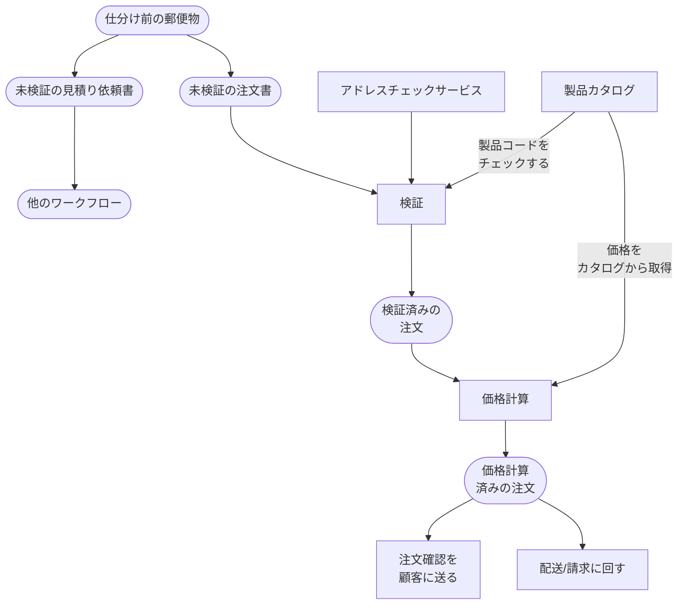

# ドメインの理解

インタビュー
ワークフローのインプットとアウトプットだけに着目→設計の詳細に振り回されない
コマンド/イベント式のいいところ→１つのワークフローにだけ焦点をおいた短いインタビューを行える→ドメインエキスパートの空いてる時間を使える可能性が高い
よいインタビュー→相手の話をしっかりときくこと、結論を急ぎすぎない

## 非機能要件の理解

顧客の業務からワークフローの規模、文脈（おそらく背景情報）を把握する
非機能要件→性能、可用性、拡張性、セキュリティ、運用・保守性

## インプットとアウトプット
ワークフローのアウトプット→ワークフローが生成するイベント→境界付らたコンテキストにおけるコマンド（アクション）のトリガー

## 衝動との戦い

ドメインから設計を導き出す→システムの実装が混ざらないようにする

### データベース

DBスキーマをドメインモデル設計に反映しない→永続性非依存→データベース内のデータの表現に依存しない→ドメインを正確にモデル化
なぜ永続性非依存が重要なのか？→データベースの設計が紛れ込むと、ドメインモデルを歪めてしまうから

### クラス設計

オブジェクト指向のクラス設計をドメインモデル設計に反映しない→基底クラスの設計など、ドメインモデルにはありえないモデリングを持ち込んでしまうのを防ぐ

## ドメインの文書化

技術的な先入観を持たないように要件を記録するには？

UML→作業がしにくく、ドメインの微妙な部分を表すには十分な詳細さが得られない  
この章では、シンプルなテキストベースの言語で作成する


ワークフローの図解


Bounded context → 境界付けられたコンテキスト、つまりサブドメイン  
workflow → ワークフロー名  
triggered by 処理のトリガー  
primary input 入力  
other input その他の入力  
output evnets　ワークフローの結果、出力されるイベント  
side-effects　ワークフローが実行されると起こるコマンド  


- workflowの定義

```
Bounded context: Order-Taking

workflow: "Place order"
    triggered by:
        "Order form received" event (when Quote is not checked)
    primary input:
        an order form
    other input:
        product catalog
    output events:
        "Order Placed" event
    side-effects:
        an acknowkedgment is sent to the customer,
        along with the placed order
```

ワークフローに関連するデータ構造を以下のように文書化する  
p26既存注文書からわかるものは確定されてる  

- [ ] お客様名
- [x] 請求先住所
- [x] 配送先住所
- [x] 注文書種別判別チェックボックス→ワークフローの判別でできてる
    - [x] 注文チェックボックス
    - [x] 見積もり
- [ ] お急ぎ便チェックボックス
- [x] 注文レコード
    - [x] 製品コード
    - [x] 数量
    - [x] 価格
- [ ] 小計
- [ ] 送料
- [ ] 合計


入出力データ  
```
Bounded context: Order-Taking

data Order = 
    CustomerInfo
    AND ShippingAddress // 請求先住所
    AND BillingAddress // 配送先住所
    AND list of OrderLines // 注文
    AND AmountToBill // 税金額（合計-小計）

data OrderLine = 
    Product // 製品コード
    AND Quantity // 数量
    AND Price // 価格

data CustomerInfo = ??? // 未定
data BillingAddress = ??? // 未定
```

ここでクラス階層やデータベーステーブルを作成してはいけない


見積もりの提示についてやってみる  
workflowのみ、入出力データは共通のはず。

```
Bounded contex: "Order-Taking" 
workflow: create a quote
    triggered by:
        "Order form received" event (when Quote is checked)
    primary input:
        an order form
    other input:
        product catalog
    output events:
        "Created a quote" event
    side-effects:
        Send quotes and confirmations to customers
```

## 受注のワークフローを深堀する

ワークフローを具体的に理解するためにドメインエキスパートとワークフローの深堀をする  
注文 > 見積もり  
要件を扱う際の尺度→開発プロジェクトの背景には、ほとんどの場合、お金を稼ぐこと（あるいはお金を節約すること）がある。  
**要件の優先度づけの判断基準にこまったら**金に従えば良い

その他ストーリなので割愛

## 複雑さをドメインモデルで表現する



### 制約条件の表現

先程登場していたワークフローに制約条件の記述を追加していく。  

```
context: Order-Taking

data widgetCode = string staring with "w" then 4 digits  
data CizmoCode = string staring with "G" then 3 digits  
data productcode = widgetCode OR GizmoCode  
data UnitQuantity = integer between 1 and 1000  
data kilogramQuantity = decimal between 0.05 and 100.00  
```

### ライフサイクルの表現（注文にライフサイクルをつける）


未検証・検証済みの注文といった具合に、注文の種別を増やし、ライフサイクルを区別する  

data UnvalidatedOrder = 
    UnvalidatedCustomerInfo  
    AND UnvalidateshippingAddress  
    ...

### ワークフローのステップを具体化する

doとifを使って、ステップを記述する

```
workflow "Place Order" =
    input: orderForm
    output:
        OrderPlaced event (put on a pile to send to other teams)
        OR InvaildOrder (put on appropriate pile)
    do ValidateOrder
    if order is invalid then:
        add InvalidOrder to pile
        stop
    
    do PriceOrder

    do SendAcknowledgmentToCustomer

    return OrderPlaced event (if not errors)
```

substepを使ってステップを細分化していく

```
substep "Validate Order" = 
    input: UnvalidatedOrder
    output: ValidateOrder OR ValidationError
    dependencies: CheckProductCodeExists, CheckAddressExitsts

    validate the customer name
    check that the shipping and billing address exist
    for each line:
        check product code syntax
        check that product code exists in ProductCatalog

    if everything is OK, then:
        return ValidatedOrder
    else:
        return ValidationError
```

