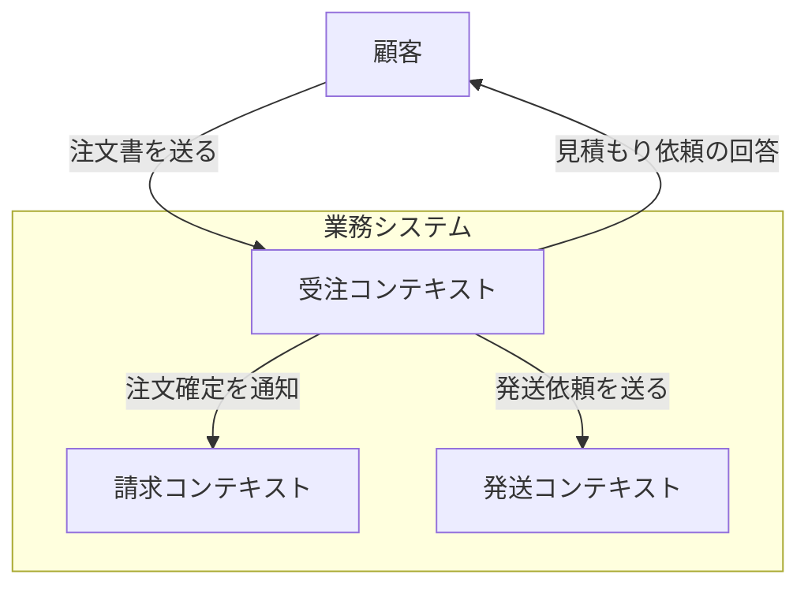

1-1 ～ 1-3 のおさらい

* 伝言ゲームによる開発者⇔ドメインエキスパートの認識齟齬を防ぐために、モデルを共有しよう
* ソフトウェアモデルとビジネスドメインを一致させると良いことがあるよ
* ドメインは少しずつ重なっているため、分割した他のドメインについても理解しないといけないよ

---

### 1-4. 境界づけられたコンテキストを利用した解決手段の作成

問題の理解 ≒ 解決策の構築

* 「問題空間」と「解決空間」に区別しよう
* 「解決空間」には「問題空間」のドメインモデルの必要な側面のみを抽出する

DDD用語：境界づけられたコンテキスト とは？

* 英語で Bounded Context と呼ばれ、BC と略される
* システムの一部を明確な境界を持つ「コンテキスト」として定義すること を示す

「コンテキスト」：解決手段における何らかの専門知識 

何故「境界づけ」る？
* ソフトウェアは、別々のサブシステム間の結合を減らし、それぞれが独立して進化できるようにする
* そのため、設計段階で「境界づけ」る

### 1-4-1. コンテキストを正しく区別する

正しく「境界づけ」るためのガイドライン

* ドメインエキスパートの声に耳を傾ける
* 既存のチームや部門の境界に注目
* 「境界づけられた」という部分を忘れない
* 自律性を目指して設計する
* 摩耗のないビジネスワークフローを目指して設計する

下の2つが大事だと思った

#### 自律性を目指して設計する

* 1つの BC に2組のドメインエキスパートのグループが関与してしまうと、2人のランナーが足を繋いで走るようなもの。
* 二人三脚で進むより、それぞれが独立して進める方が進みが早い
* 出来るだけ分離して進化できるように設計する

#### 摩耗のないビジネスワークフローを目指して設計する

* 設計の単純さも大事だが、顧客に「より良い」製品を届けることが本質であることを忘れない
* 設計が多少「煩雑」になったとしても、顧客のワークフローがスムーズになるようにする

要は、設計の単純さと顧客価値の両立をするために、ドメインエキスパートと密に連携していきましょうという理解

### 1-4-2. コンテキストマップ

* 以下のように様々な BC の関係性をマップで表す
  * mermaid で書くなら以下のような感じ

* 本書の例では1つのマップに全て収まっているが本来は特定のサブシステムごとにマップを作っていく事を推奨

### 1-4-3. もっとも重要な BC に焦点を当てる

* ドメインが幾つかある中で、コアドメインがどれかを考えて優先度をつけよう
* どれが重要なドメインかは、製品の特性や企業理念にも寄る
* どのような場合でも優先度をつけて、もっとも価値のある境界づけられたコンテキストに焦点を当てる

### 1-5. ユビキタス言語の創造

#### 「ユビキタス言語」：チーム全員が共有する概念と語彙のセット

* 設計において、コードとドメインエキスパートで同じモデルを共有するために、振舞いを表す共通言語が必要
* ドメインエキスパートが「注文」と呼んでいるものがあれば、コード上でも「Order」と呼ばれるものを用意するべき
* ユビキタス言語の構築は、ドメインエキスパートが一方的に決めるのではなく、チーム全員で協力して考え、納得する形を探す
* 全てのドメインやコンテキストをカバーする単一のユビキタス言語は構築できない

### 1-6. 概念の要約

* ドメイン
  * 解決しようとしている問題にいい関連する知識の領域
* ドメインモデル
  * 特定の問題に関連した側面を単純化したもの
* ユビキタス言語
  * ドメインに関連する概念と語彙の集合。チームメンバーとソースコードの両方で使用される
* 境界づけられたコンテキスト (BC)
  * 解決空間内のサブシステムであり、問題空間のサブドメインに対応することが多い
* コンテキストマップ
  * 境界づけられたコンテキスト間の関係を表すもの
* ドメインイベント
  * システムで起こったことの記録。イベントは常に過去形で記述される
* コマンド
  * 何らかの処理を開始する要求
