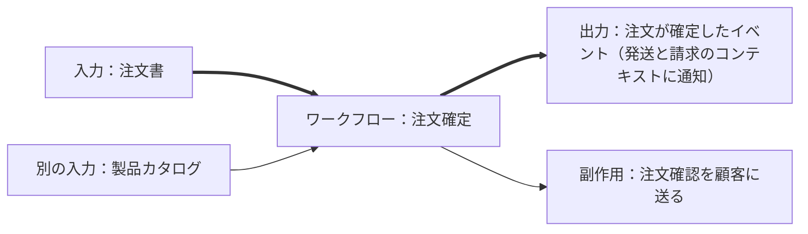

# 2.1 ドメインエキスパートへのインタビュー
ドメインエキスパートは多忙な傾向にあり、一般的に開発者とあまり多くの時間を過ごすことはできない

しかし、コマンド／イベント方式なら2つのワークフローだけに焦点を当てた短いインタビューを行える  
　→ドメインエキスパートは時間を割ける可能性が高い

インタビューの最初のフローでは、大まかに**ワークフローのインプットとアウトプットにのみ焦点を当てる**  
そうすることで、設計に関係のない詳細な情報に振り回されることを避けられる

今回の例では「注文確定のプロセス」のみについて話している

ドメインエキスパートが見せてくれた注文書を見て、  
開発者は、典型的なEコマースモデルだと考えたが、実は違った

開発者
* Webサイトのページを閲覧し、クリックして、ショッピングカートに追加し、チェックアウトする

ドメインエキスパート
* 製品コードと数量を入力できるだけで問題ない。  
  一度に200～300個の商品を注文することもあるので、商品ページをクリックして各商品を探すのでは時間がかかりすぎる

教訓：ドメインについて学ぶのだから、顧客がシステムをどのように使用するかなど、何かについて結論を急ぎたい衝動に駆られてはいけない

良いインタビューとは、相手の話をしっかり聞くこと  
ドメインについて学ぶ最良の方法は**先入観を持たないこと**

理想的には、設計を決定する前に人々の仕事ぶりを観察したり、ユーザビリティテストをしたりして、綿密に調査すること  
今回はドメインエキスパートがお客様のニーズを十分に理解し、それを伝えてくれているため、リスクを取ってこれらのステップを省略する

## 2.1.1 非機能要件の理解
ワークフローの文脈や規模について話し合うのも良い

紹介されている例でいうと
* 1日あたりどれだけの注文数がくるのか
* 注文数に波はあるのか
* システムを利用する人のレベル（初心者向けシステムなのか、上級者向けシステムなのか）
* レイテンシーやレスポンスについて

これらを聞くことで、スケール感やトラフィック対策の必要性、どのような設計にするか、データ処理の強固さや証跡を残すかどうかなどの要件が見えてくる

## 2.1.2 残りのワークフローの理解
2.1で見せてもらった注文書を利用した仕事のフローをインタビューしている  
ここでは、以下のフローが明らかになった
1. 「製品カタログ」を確認し、製品コードが正しいか確認する
2. 個々の価格を合計し、注文書の下にある「合計」フィールドに記入する。オリジナルはファイルに保存する
3. 注文をスキャンして、お客様にメールで送り、価格や支払金額を確認してもらう
   1. このフェーズを『注文確認』と読んでいる
4. 同じ注文書を利用するが、商品の発送は行わない「見積」と、商品の発送を行う「注文」が存在する

## 2.1.3 インプットとアウトプットを考える
ワークフローのインプットとアウトプットについて学んだことを記録する

インプットは明らかに注文書だが、アウトプットはなにか？  
インタビューでは「完了した注文」という概念を見ていた。  
しかし、これはアウトプットではない。直接なにかに使わないため。

では「注文確認」はどうか？アウトプットになるか？  
「注文確認」は注文を出すワークフローの副次的効果であり、アウトプットではない。

ワークフローのアウトプットとは**ワークフローが生成するイベントであり、他の境界づけられたコンテキストにおけるアクションのトリガーでなければならない**  
今回のケースではワークフローのアウトプットは「注文が確定した」というイベントのようなもので、  
これが発送と請求のコンテキストに送られる

実際にワークフローを表すと以下のような形になる

