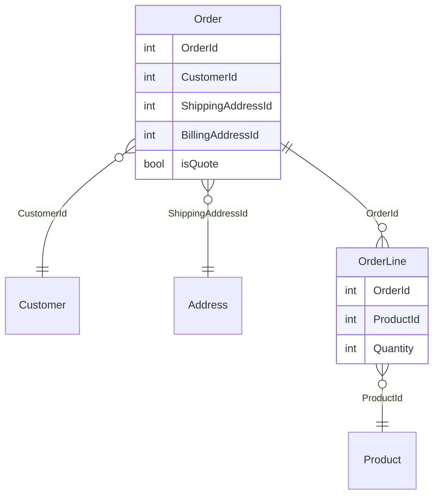

# 2.2 データベース駆動設計をしたいという衝動との戦い
この時点で、ほとんどの開発者は詳細な設計と実装をすぐにスケッチしたくなる

たとえば、注文書は「顧客の情報」「いくつかの住所」「明細行のリスト」で構成されている

データベースの経験が豊富な人であれば、最初の直感でテーブルとその間の関連について考えるかもしれない  
Orderテーブル、OrderLineテーブル、Customer、Address、Productテーブルなどを思い浮かべる  
そして、それらの間の関連を以下のように記述する

しかし、これをやってしまうと間違いを犯してしまう  
ドメイン駆動設計では、データベースのスキーマではなく、**ドメインから設計を導き出す**  
ドメインを元に設計を始め、特定のストレージの実装を考慮せずにモデル化するのが良い

現実の紙ベースのシステムでは、データベースは存在していない  
「データーベース」という概念は確実にユビキタス言語に含まれていない  
ユーザは、データがどのように永続されているかについて気にしていない

DDDの用語では、これを**永続性非依存**と呼ぶ  
これは、データベース内のデータの表現を気にすることなく、ドメインを正確にモデル化することに集中させてくれる、重要な原則  
常にデータベースの視点で設計していると、データベースモデルに合わせて設計を歪めてしまう事が多い

データベース駆動なモデルがもたらす歪めの例として、前の図では注文と見積もりの違いをすでに無視している  
たしかにデータベース上では両者を区別するフラグを立てることができているが、ビジネスルールや検証ルールは異なる  
例えば「Order（注文）には請求先住所がなければならないが、Quote（見積）には請求先住所がない」ことがわかったとすると、これを外部キーでモデル化するのは困難になる  
同じ外部キーが両方のタイプの関連に兼用されているため、データベースの設計ではこの微妙な点が失われてしまう

もちろん、設計を修正するという対処もできるし、「第12章 永続化」ではドメイン駆動設計をリレーショナルデーターベースに永続化させる方法を見ていく。  
しかし、今は先入観を持たずに耳を傾けることに集中する
