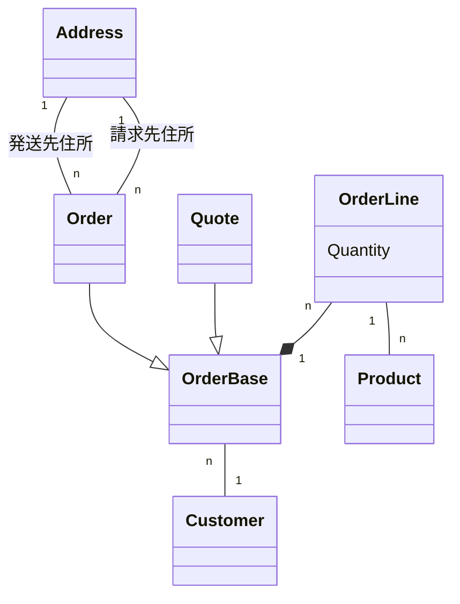

# 2.3 クラス駆動設計をしたいという衝動との戦い
もし、オブジェクト指向の経験豊富な開発者なら、特定のデータベースモデルに偏らないという考え方は馴染み深い  
実際、依存関係の注入などのオブジェクト指向技術は、データベースの実装をビジネスロジックから分離することを推奨している

しかし、そんな経験豊富な開発者でも、ドメインではなくオブジェクトのことを考えてしまうと、設計に先入観を持ち込んでしまう可能性がある

例えば、以下の図のようなクラスを頭の中で作っているかもしれない

クラス駆動の設計は、データベース駆動の設計と同じくらい危険  
上図の予備設計では、注文と見積を分離しているが、現実の世界には存在しない”OrderBase”を導入している  
これはドメインの歪曲である  
ドメインエキスパートにOrderBaseとは何かを聞いてみてください

ここで学ぶべきなのは、要件収集の際にはすべてを受け入れる姿勢を保ち、**自分の技術的な考えをドメインに押し付けないこと**