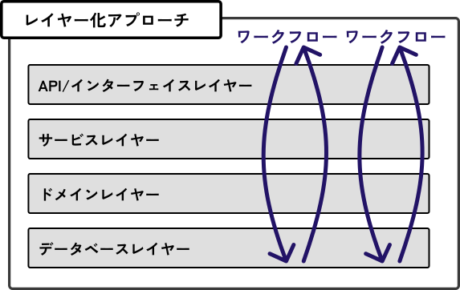
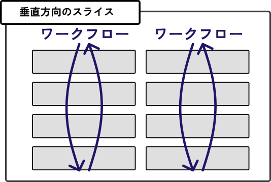
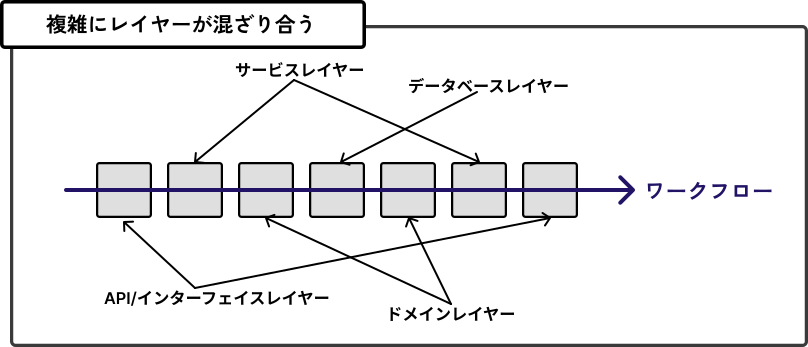
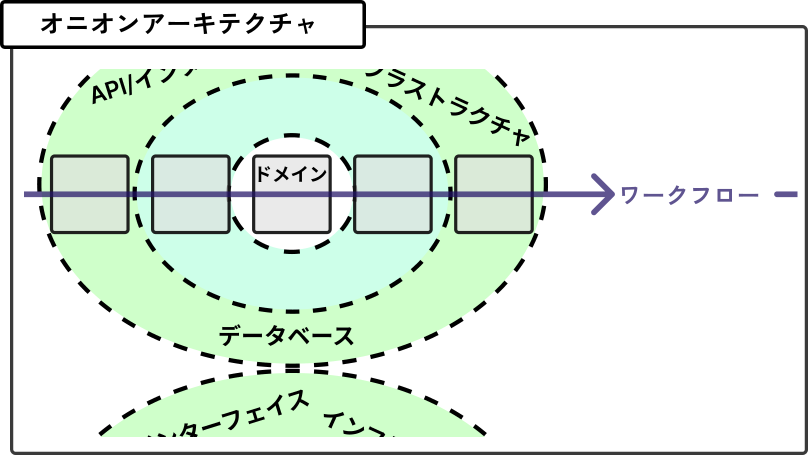

## 3.5 境界づけられたコンテキストの中のコード構造

### レイヤー化アプローチ(伝統的なアプローチ)

レイヤー化アプローチでは、コードを、以下の図のように各層に分ける。

ワークフローは、最上層から始まり、データベースレイヤーまで作業を進めて、最上層に戻ってくる。

#### レイヤー化アプローチには課題がある

- 「一緒に変更されるコードは一緒に配置されるべき」という重要な設計原則を破ってしまう。
  → レイヤーが「水平方向」に組み立てられているため、ワークフローの動作方法を変えると、全てのレイヤーに手を入れる必要がある。

より良い方法は「垂直方向」のスライスに切り替えること。
ワークフローの要件が変わった場合、特定の垂直方向のスライスのコードのみ変更する必要がある。

これでもまだ理想的ではない。
ワークフローを横方向のパイプにして、その中でレイヤーを見てみると、、

レイヤーが混ざり合い、ロジックを理解(そしてテスト)するのが、**不必要に複雑になる**。

---

### 3.5.1 オニオンアーキテクチャ

レイヤー化アプローチの代わりに、ドメインコードを中心に置き、その周りに他の側面を配置する。

#### オニオンアーキテクチャのルール
- 各レイヤーは内側のレイヤーにのみ依存する。
- 外側のレイヤ-には依存しない。

他にも、「ヘキサゴナルアーキテクチャ」や「クリーンアーキテクチャ」等の類似のものもある。
全ての依存関係が内側に向くようにするためには、依存関係の注入に相当する機能を使用することになる。
→第９章にて解説。

---

### 3.5.2 I/Oを端に追いやる

関数型プログラミングの主な目的は、**内部を見なくても、予測可能で理解しやすい関数を扱うこと**。  
そのために、**可能な限り不変のデータを扱い、関数が隠れた依存関係ではなく、明示的な依存関係を持つように**する。  
**もっとも重要なことは、関数の副作用を避けること**。  

例を挙げると、ランダム性、関数の外にある変数の書き換え、そして何より避けたいのは、あらゆる種類のI/O。  
たとえば、データベースやファイルシステムを読み書きする関数は「不純」とみなされるため、コアドメインではこのような種類の関数を避けるようにする。  

では、どのようにしてデータを読み書きするのか。  

その答えは、あらゆる **I/Oをオニオンの端に追いやる**こと。  
たとえば、データベースへのアクセスは、**ワークフローの内部ではなく、ワークフローの開始時または終了時にのみ行う**ようにする。  
→ 異なる関心事を分離するという利点もある。  

コアドメインモデルはビジネスロジックだけを対象とし、永続性などのI/Oはインフラストラクチャの関心事にできる。  

I/Oやデータベースへのアクセスを端に追いやるという手法は、前章で紹介した永続性非依存という概念に非常にマッチしている。  

→ 「第12章 永続化」では、データベースの使用についてより詳しく説明。
