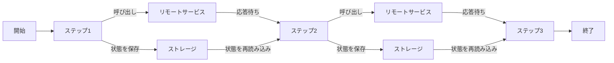
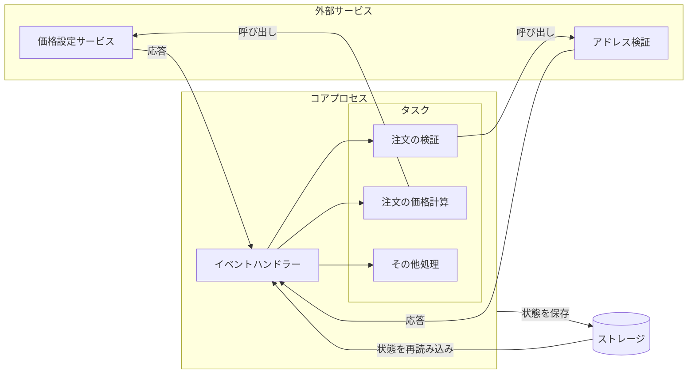

## 7.9 長時間動作するワークフロー

これまでのパイプラインは数秒程度の短い想定でした。
時間がかかるようなリモートサービスの呼び出があるといってもちょっとapiを叩くくらいですね。  
もし各ステップに数時間、数日かかるような場合、どのような構成にすればいいでしょうか？

新規に以下の作業が必要となります。
- ステップの状態管理
- 障害発生時のリカバリー定義

ステップの状態を永続化することで、各ステップが独立したプロセスとなり、それこそ別のサーバーで動いていても問題ありません。
また、それぞれが別のプロセスで実行するということは１つのトランザクションで実行できないということです。そのため、失敗時のリカバリー方法を前もって定義しておく必要があります。
例えば、失敗時には再実行するのか、逆の処理を実行して元に戻すのか、などです。
このようなワークフローを**Saga**と呼びます。

今回の例はシンプルですが、もしよりイベントや状態の数が増え複雑になった場合は、**プロセスマネージャ**というものが必要かもしれません。

Sagaではあくまでイベントによりどの処理を実行するかを決定します。それに対してプロセスマネージャーはイベントだけでなく、現在の状態に基づいて次の処理を決定します。

参考
- https://vasters.com/archive/Sagas.html
- https://learn.microsoft.com/ja-jp/azure/architecture/patterns/saga